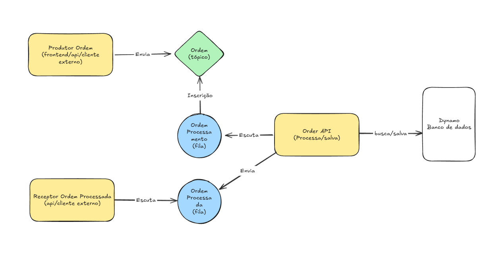

# Como executar o projeto

Execute o comando `docker-compose up --build -d` na raiz do projeto.

Após um tempo de build do docker, será iniciado o Local Stack (simulação serviços AWS), Terraform (IaC) e as APIs (estão em amarelo na imagem).
Você pode acompanhar os logs de cada API através dos containers docker. Caso queira verificar os registros no banco de dados Dynamo, recomendo baixar o [NoSQL Workbench for DynamoDB](https://docs.aws.amazon.com/amazondynamodb/latest/developerguide/workbench.settingup.html)

Os registros ocorrem a cada 1 segundo.
