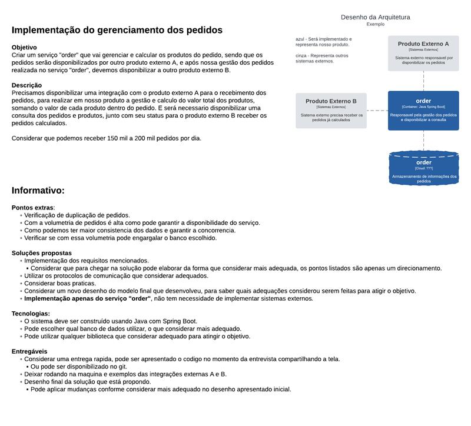

# API Basic Order

## Introdução

Antes de iniciar a implementação, optei por pensar primeiro na arquitetura antes de colocar a mão no código. Desconsiderei toda a parte de segurança (autorização, autenticação ou security provider), pois além de não estar descrita como obrigatória, traria mais uma camada de complexidade à solução. Minhas decisões foram tomadas com base nas experiências que adquiri até o momento e no meu contato com arquitetura de sistemas, sempre priorizando a tecnologia que melhor atende à solução, e não apenas as ferramentas com as quais já estou familiarizado. Sei que ainda há muito a aprender e, caso alguma escolha possa ser aprimorada, este é o nível de conhecimento que possuo atualmente. Estou sempre aberto a feedbacks para evolução contínua.

## 1. Escolha do Banco de Dados

O primeiro passo foi escolher um banco de dados que atendesse aos requisitos de alta performance tanto para escrita quanto para leitura. Como estamos lidando com um alto volume de pedidos diários (150k a 200k), a escolha do banco deveria considerar:

- **Alta performance na escrita:** O banco precisa suportar uma grande quantidade de inserções sem comprometer o desempenho.
- **Alta performance na leitura:** Como poderemos precisar consultar pedidos por cliente, considerei essa necessidade ao definir a estratégia de leitura.
- **Escalabilidade:** O banco precisa suportar crescimento sem perda de performance.

Dado esse cenário, a escolha foi por **bancos NoSQL**, que permitem maior flexibilidade e escalabilidade. Dentre as opções analisadas:

- **Cassandra**: Boa opção por ser distribuído, altamente escalável e suportar grandes volumes de escrita.
- **MongoDB**: Possui flexibilidade no modelo de documentos e indexação eficiente para consultas específicas.
- **DynamoDB**: Solução gerenciada da AWS, altamente escalável e com capacidade de auto ajuste de throughput.

Além disso, ao considerar a leitura distribuída, poderia ser aplicada uma estratégia de nós para bancos somente de leitura. Isso ajudaria a aliviar a carga das operações de consulta sem impactar diretamente na performance da escrita.

## 2. Definição das Stacks: Low Cost x Cloud

Após definir a base de dados, estruturei duas abordagens para implementação da solução:

### **Opção 1: Stack Low Cost (On-Premise)**
- **Banco de dados:** Cassandra
- **Mensageria:** Kafka
- **API:** Microserviço em Java rodando em instâncias on-premise

Essa opção traz maior controle sobre custos, mas exige maior esforço operacional para manter a infraestrutura funcionando corretamente.

### **Opção 2: Stack Cloud (AWS)**
- **Banco de dados:** DynamoDB
- **Mensageria:** SNS + SQS
- **API:** Poderia utilizar **Lambdas** ou **ECS/Fargate**, dependendo da necessidade de escalabilidade e gerenciamento.

A opção em nuvem oferece maior escalabilidade e menor esforço operacional, porém com um custo maior.

## 3. Estratégia de Otimização de Leitura com Cache

Embora eu não tenha muita experiência com essa etapa, sei da importância do cache devido ao alto volume de dados. Dessa forma, adotei essa estratégia para otimizar a leitura e reduzir a carga sobre o banco de dados.

Como os modelos de consulta não foram especificados, assumi que a principal consulta seria por cliente. Com isso, implementei a estratégia de cache para armazenar os pedidos já consultados, reduzindo a necessidade de acesso ao banco.

A ideia seria:
1. Ao buscar um pedido pela primeira vez, armazená-lo no cache.
2. Se o mesmo pedido for consultado novamente, ele será recuperado diretamente do cache.
3. Caso alguma informação do pedido seja alterada, o cache deve ser atualizado.
4. O cache teria um tempo de expiração para evitar informações desatualizadas.

## 4. Escolha Final: Stack Cloud

Decidi seguir com a **Stack Cloud** para demonstrar meu conhecimento em integração com AWS. Além disso, essa abordagem permite maior escalabilidade, menos esforço operacional e maior resiliência para lidar com o alto volume de pedidos.

---
Essa foi a linha de raciocínio que segui para estruturar a solução. Se houver alguma melhoria ou ajuste, estou aberto a feedbacks!

